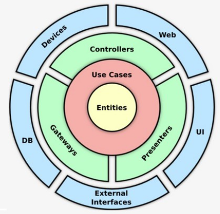
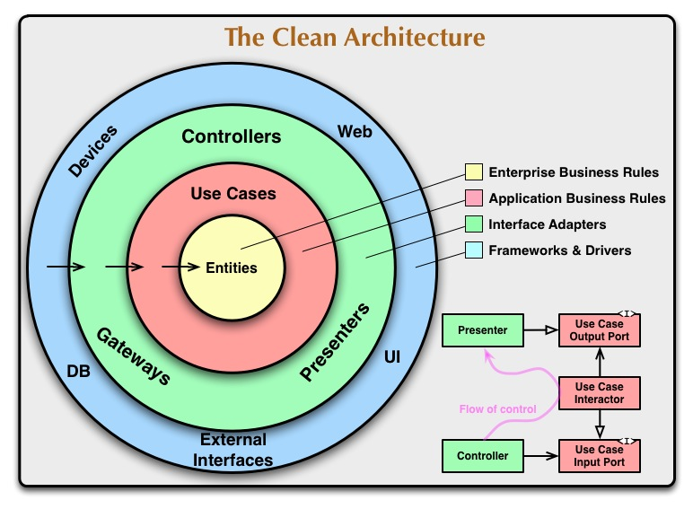

  

    
    
  
  
  <h1 align="center">MS SnackHub Order com Clean Architecture</h1>
   
    Este projeto tem a finalidade educacional de um Microserviço responsável por montar um pedido de um estabelecimento de lanchonete, como parte do Tech Challenge do Curso de Arquitetura de Software.

# Conceito

## O que é Clean Architecture?

Clean Architecture, também conhecida como Arquitetura Limpa, é uma abordagem de desenvolvimento de software proposta por Robert C. Martin, um renomado engenheiro de software, autor e consultor. A principal ideia por trás da Clean Architecture é criar sistemas que sejam independentes de frameworks, banco de dados e detalhes de interface do usuário, enfatizando a separação de preocupações e a clareza na organização do código.

O objetivo da Clean Architecture é desenvolver sistemas altamente sustentáveis, testáveis e escaláveis, facilitando a manutenção contínua ao longo do tempo, permitindo a troca de componentes sem alterar a lógica central e tornando o código mais compreensível para novos desenvolvedores que trabalham no projeto.

Essa arquitetura promove a separação de preocupações e permite que cada camada se concentre em sua responsabilidade específica. A ideia é que as dependências fluam de dentro para fora, ou seja, as camadas internas não devem depender das camadas externas, tornando o sistema mais modular e independente.

## Decisão Arquitetural do Desafio

O projeto SnackHub possui três principais módulos:
* Domain
* Application
* Infrastructure

## Domain

Nesse módulo estão presente as nossas classes de dominio, projetadas com a utilização de práticas do DDD.
No cenário do Clean Architecture representam as Entities.

As classes presente nesse módulo não possuem nenhuma dependência externa ou de framework.

## Application

A camada de Use Case é responsável por implementar os casos de uso específicos do negócio da aplicação.
A caracteristica desse módulo é abstrair de regras de negócio: A camada de Use Case contém a lógica do negócio da aplicação, mas sem detalhes de implementação relacionados a infraestrutura ou apresentação.

## Infrastructure

A camada de infraestrutura é uma das camadas principais do Clean Architecture (Arquitetura Limpa) proposta por Robert C. Martin.
Essa camada é responsável por lidar com os detalhes técnicos, como o acesso a bancos de dados, serviços externos, sistemas de arquivos e outras tecnologias que não são específicas do domínio da aplicação. Sua principal função é permitir a comunicação entre a aplicação e o mundo externo, mantendo a lógica de negócio isolada e independente de detalhes de implementação.

# Persistência
No microserviço estamos utilizando um banco de dados relacional (SQL) MySQL.

# Arquitetura SAGA

### Escolhendo a abordagem coreografada no padrão SAGA de microserviços

## O que é o padrão SAGA?

O padrão SAGA é uma técnica para manter a consistência dos dados em sistemas distribuídos, especialmente em arquiteturas de microserviços. O padrão foi criado com o desafio das transações distribuídas, onde uma operação pode envolver vários serviços que precisam ser coordenados de forma consistente.

### Existem duas abordagens principais dentro do padrão SAGA:  coreografia e orquestração

- Coreografia: Os serviços colaboram entre si, sem a necessidade de um controlador central. Cada serviço é responsável por suas próprias ações e reage a eventos gerados por outros serviços.

- Orquestração: Envolve um serviço centralizado (geralmente chamado de orquestrador) que coordena e controla as transações entre os serviços participantes.

Vantagem da abordagem coreografada no padrão SAGA?

- Desacoplamento: A abordagem coreografada promove um maior desacoplamento entre os serviços. Cada serviço conhece apenas as interações com os outros serviços com os quais precisa se comunicar diretamente. Isso facilita a manutenção, escalabilidade e evolução do sistema, já que as mudanças em um serviço têm menos impacto nos outros.

- Escalabilidade: Como não há um ponto central de coordenação, a abordagem coreografada pode ser mais escalável em ambientes onde a carga é distribuída de forma desigual entre os serviços. Cada serviço pode escalar independentemente para atender à demanda.

- Resiliência: A coreografia distribui a lógica de coordenação entre os serviços participantes. Isso significa que o sistema pode continuar funcionando mesmo se alguns serviços estiverem inativos, desde que outros serviços ainda possam operar independentemente.

- Flexibilidade: A abordagem coreografada é mais flexível em termos de evolução do sistema. Novos serviços podem ser adicionados e serviços existentes podem ser modificados sem a necessidade de alterações significativas no orquestrador central.

- Menos ponto único de falha: Em uma abordagem orquestrada, o orquestrador central pode se tornar um ponto único de falha e um gargalo de desempenho. Na coreografia, não há esse risco, pois não há um ponto centralizado de controle.

### Conclusão

Embora a escolha entre orquestração e coreografia no padrão SAGA dependa das necessidades específicas do sistema, a abordagem coreografada oferece vantagens significativas em termos de desacoplamento, escalabilidade, resiliência, flexibilidade e robustez contra falhas. Ao optar por uma abordagem coreografada, deixamos nossos serviços mais resilientes, flexíveis e escaláveis. 

## Explicação SAGA e AWS
[Vídeo Explicativo da FASE 5](https://www.youtube.com/watch?v=l5SeNVO6qpA)

### Organização dos Serviços seguindo o padrão SAGA escolhido

## Arquitetura AWS

## OWASP ZAP

O OWASP ZAP (Zed Attack Proxy) é uma ferramenta de segurança de software de código aberto usada para encontrar vulnerabilidades em aplicações da web durante o desenvolvimento e testes de segurança. Ele realiza varreduras automatizadas em aplicações da web em busca de falhas de segurança, como injeções de SQL, cross-site scripting (XSS) e outros tipos de vulnerabilidades comuns, ajudando a identificar e corrigir esses problemas antes que sejam explorados por invasores.

No Serviço foram feitas duas varreduas uma antes e depois dos ajustes citados nos relatórios (Foi adicionado os reports formato HTML e gerado em PDF).

[Report 1](readmefiles%2Foswaspzapreport%2Fbefore%2F2024-03-17-ZAP-Report.html)

[ZAP Scanning Report Before.pdf](readmefiles%2Foswaspzapreport%2FZAP%20Scanning%20Report%20Before.pdf)

Com os alertas citados foi implementado o XContentTypeOptionsHeaderFilter setando o header X-Content-Type-Options

[Report 2](readmefiles%2Foswaspzapreport%2Fafter%2F2024-03-17-ZAP-Report-.html)

[ZAP Scanning Report After.pdf](readmefiles%2Foswaspzapreport%2FZAP%20Scanning%20Report%20After.pdf)

Após a correção o report foi gerado sem alertas.

### Execução da Aplicação

Ao realizar o push no repositório do Github a pipeline do CI/CD além de verificar testes e compilar o serviço a mesma irá gerar a
imagem docker do serviço e enviar para o ECR onde será atualizado o ECS do serviço.

#### Localmente

As variaveis presentes no arquivo application-development.yml devem ser configuradas. Os docker componse ajudará a subir o ambiente sem necessitar configurações extra.